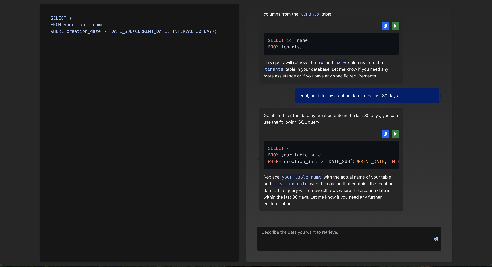
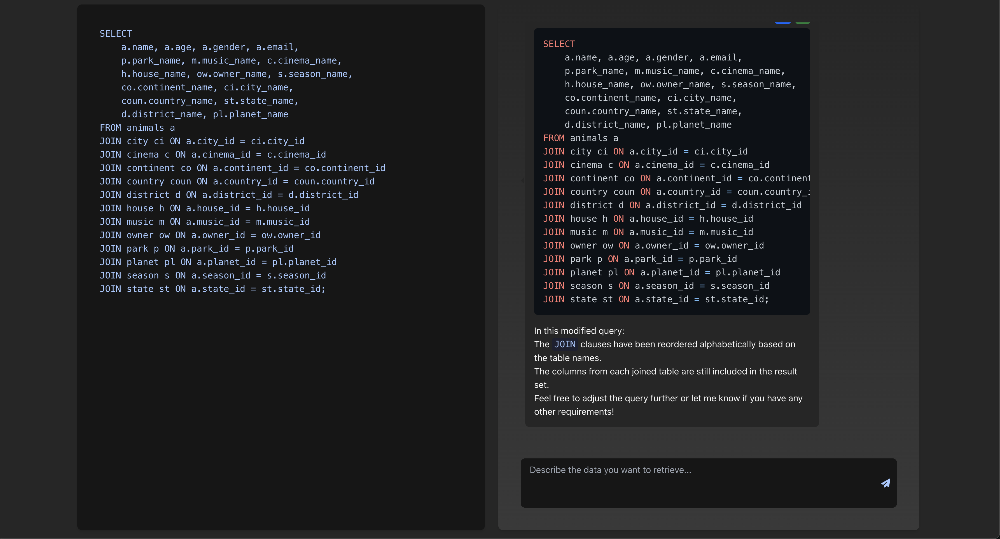

# SQL Agent


## Overview

This project is a tool that helps you create SQL queries using AI technology. It has a web interface that works like Cursor, making it easy to use. The system uses two different AI agents that work together:

1. One agent talks with you to understand what you need
2. Another agent creates the actual SQL code

### User Agent

The User Agent is the AI that you directly communicate with. It:
- Listens to your requests in normal language
- Tries to understand what information you need
- Creates a plan for getting that information from a database
- Passes this plan to the SQL Agent

### SQL Agent

The SQL Agent is the technical expert that:
- Takes the plan from the User Agent
- Knows how to write proper SQL code
- Creates the correct SQL query that will get the information you need
- Returns a working query that can be run on your database

### Web Interface

The web interface is a simple chat interface that allows you to communicate with the User Agent and the SQL Agent.




## Installation

Simply clone the repository and install the dependencies:

```bash
nvm use 20
yarn install
```

## Local Development

Set the following environment variable:

```bash
export REACT_APP_OPENAI_API_KEY=<"your-openai-api-key"
```

Simply run the start script:

```bash
nvm use 20
yarn start
```

Then, visit `http://localhost:3000` to see the app in action.

## Build

Simply run the build script:

```bash
nvm use 20
yarn build
```